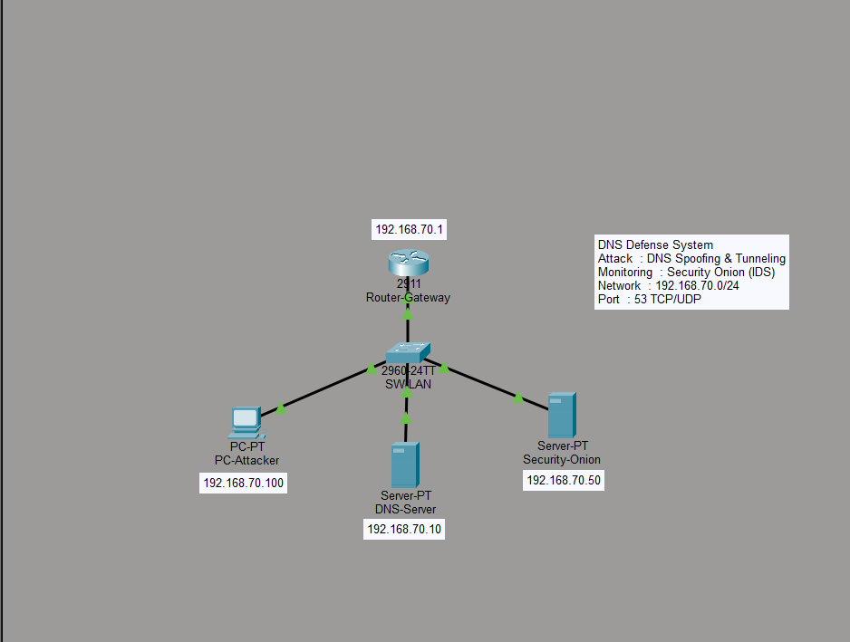
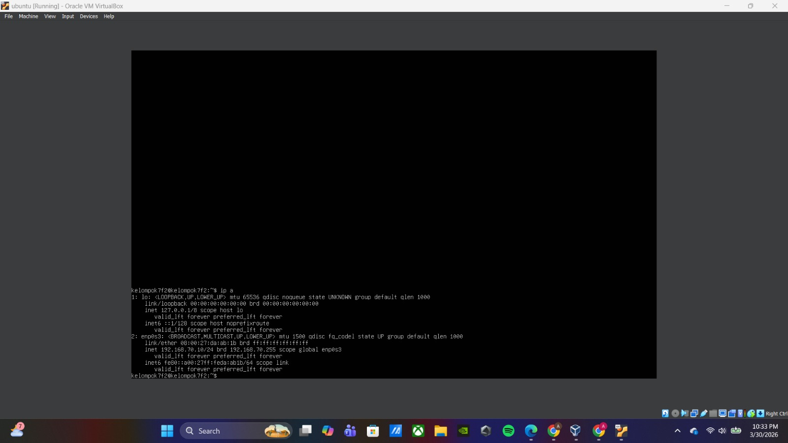
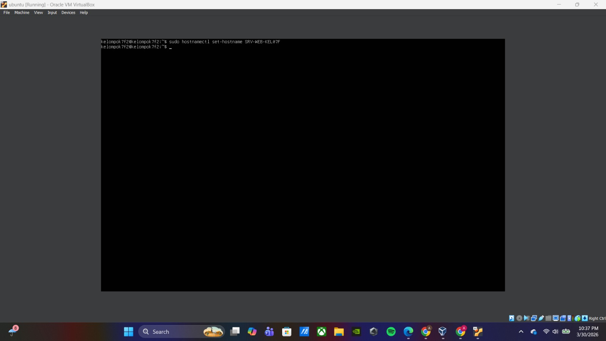
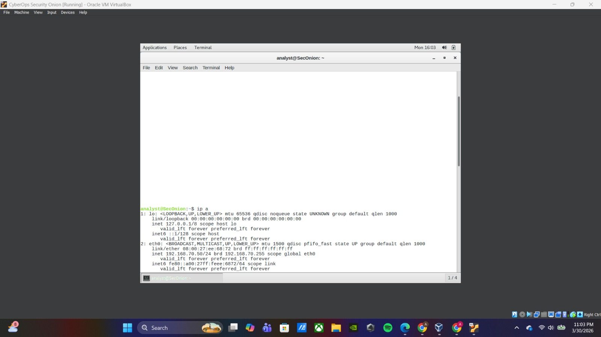
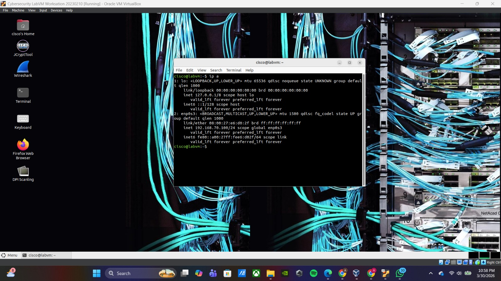
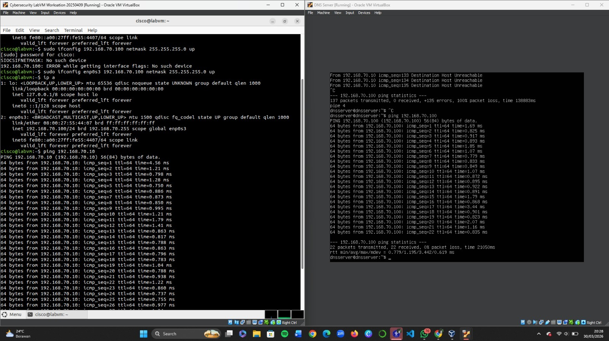
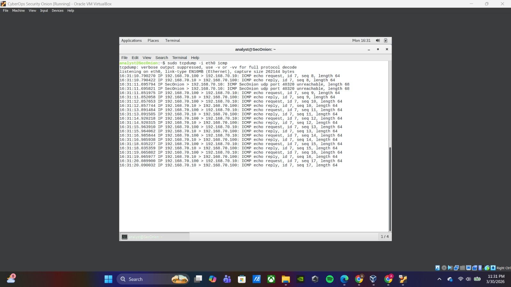

# Baseline Report - Phase 1: Hardening Review
**Kelompok 7 - Kelas F2**  
**Mata Kuliah**: TEK1314 Keamanan Siber  
**Tanggal**: 31/03/2026

---

## 1. Pendahuluan

### 1.1 Tujuan Hardening
Tujuan dari implementasi hardening pada infrastruktur lab ini adalah untuk meningkatkan keamanan layanan DNS dari ancaman seperti DNS Spoofing dan DNS Tunneling. Hardening dilakukan untuk memastikan sistem mampu mendeteksi, memonitor, dan menganalisis aktivitas jaringan yang mencurigakan.

### 1.2 Ringkasan Infrastruktur
- **Network Subnet**: 192.168.70.0/24
- **Jumlah VM**: 3 sistem
- **Skenario**: DNS Defense System

### 1.3 Standar Keamanan
Standar keamanan yang digunakan meliputi:
- Principle of Least Privilege
- Network Segmentation
- Secure DNS Configuration
- Monitoring menggunakan SIEM (Security Onion)

---

## 2. Network Hardening

### 2.1 Topologi Jaringan


**Deskripsi Topologi**:
- Attacker (192.168.70.100) sebagai sumber traffic
- Target (192.168.70.10) sebagai target layanan DNS
- Security Onion (192.168.70.50) sebagai monitoring
- Semua sistem berada dalam satu subnet dan saling terhubung melalui jaringan internal

---

### 2.2 Konfigurasi Firewall

#### 2.2.1 DNS Server (Target - 192.168.70.10)
**Firewall**: UFW  
**Status**: Aktif  

**Aturan yang Diterapkan**:
```bash
sudo ufw status verbose
```

**Screenshot**:


**Penjelasan**:
- 
- Port 22 dibuka untuk remote access
- Port lainnya diblokir untuk keamanan

---

#### 2.2.2 Security Onion (SIEM - 192.168.70.50)
**Konfigurasi Khusus**:
- Menggunakan 2 interface (management & monitoring)
- Monitoring interface menggunakan promiscuous mode
- Digunakan untuk menangkap seluruh traffic jaringan

---

#### 2.2.3 Attacker Machine (192.168.70.100)
**Isolasi Network**: Internal Network

---

### 2.3 Segmentasi Jaringan
Segmentasi dilakukan berdasarkan fungsi:
- Client (Attacker)
- Server (Target)
- Monitoring (SIEM)

---

## 3. System Hardening

### 3.1 Target (192.168.70.10)

#### 3.1.1 Identitas Sistem
- **Hostname**: SRV-WEB-KEL07F
- **IP Address**: 192.168.70.10
- **OS**: Ubuntu Server

**Bukti**:
```bash
hostname
ip a
```



---

#### 3.1.2 Layanan yang Dinonaktifkan
```bash
systemctl list-unit-files
```

**Alasan**:
Menonaktifkan layanan yang tidak diperlukan untuk mengurangi attack surface.

---

### 3.2 Security Onion (192.168.70.50)

#### 3.2.1 Identitas Sistem
- **IP Address**: 192.168.70.50
- **Management Interface**: eth0
- **Monitoring Interface**: eth1



---

#### 3.2.2 Konfigurasi Monitoring
- Menggunakan Sguil / Squert
- Monitoring traffic ICMP dan DNS
- Capture seluruh aktivitas jaringan

---

### 3.3 Attacker (192.168.70.100)

#### 3.3.1 Identitas Sistem
- **IP Address**: 192.168.70.100




## 4. Bukti Logging - Minggu ke-5

### 4.1 Koneksi Antar VM


---

### 4.2 ICMP Traffic Capture Test

#### Skenario Test
- **Source**: 192.168.70.100
- **Destination**: 192.168.70.10
- **Protocol**: ICMP

```bash
ping -c 10 192.168.70.10
```

---

### 4.3 Log di Security Onion


**Informasi Log**:
- Timestamp: [Isi dari log]
- Source IP: 192.168.70.100
- Destination IP: 192.168.70.10
- Protocol: ICMP

---

### 4.4 Verifikasi Sistem Monitoring
**Kesimpulan**:
Security Onion berhasil merekam traffic ICMP sehingga sistem monitoring berjalan dengan baik.

---

## 5. Kesimpulan

### 5.1 Ringkasan Implementasi
Sistem DNS Defense berhasil dibangun dengan komponen DNS Server dan Security Onion sebagai sistem monitoring.

### 5.2 Kesiapan Sistem
Sistem siap untuk tahap berikutnya yaitu simulasi DNS Spoofing dan DNS Tunneling.

### 5.3 Kendala yang Dihadapi
Kendala yang dihadapi meliputi konfigurasi network VM dan error pada netplan, namun dapat diselesaikan dengan penyesuaian konfigurasi interface jaringan.

---

## Lampiran

### A. Referensi Screenshot
- Topology.png
- IP Address Attacker.jpeg
- IP Address Security Onion.jpeg
- IP Address Target.jpeg
- Ping antar VM.jpeg
- hostname.jpeg
- logging-check-icmp.jpeg

### B. Command Reference
- ping
- ufw
- systemctl
- tcpdump

---

**Disusun oleh**  
Kelompok 7 - Kelas F2  

**Tanggal**  
31/03/2026
